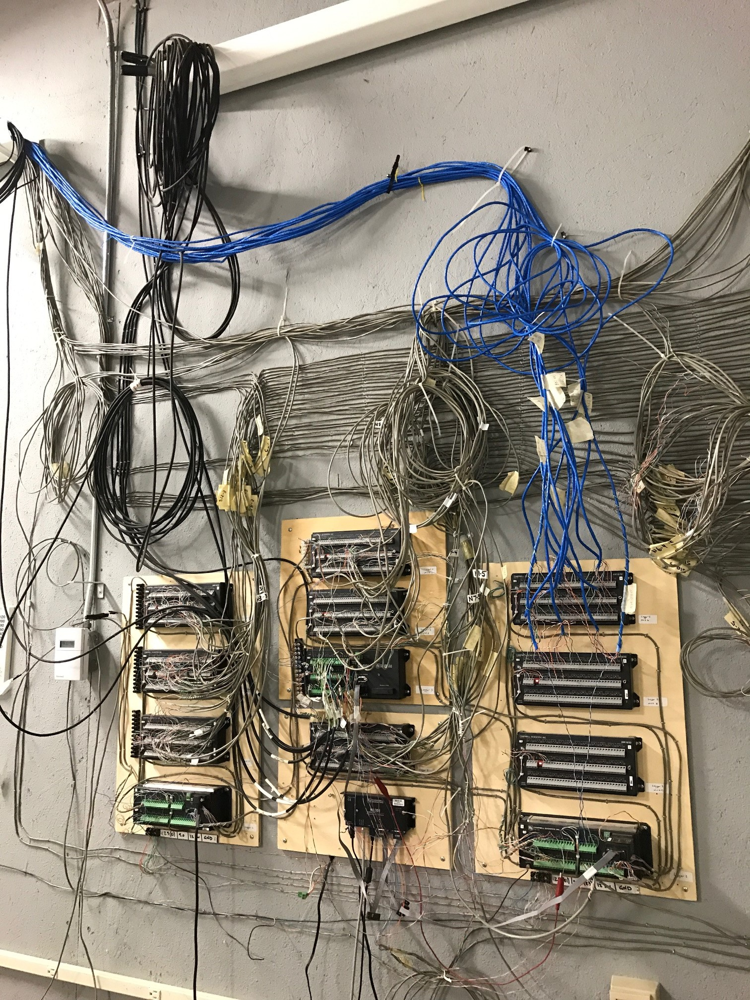

# NET Facility Logger: North Walls 7/8

## WSU Puyallup Research Extension

> Patrick O'Keeffe  
> Voiland College of Engineering and Architecture  
> Washington State University

### Work Requested

* Acquire data from recently installed sensors...
    * many point moisture measurements ([PMM Sensor; SMT Research](https://www.smtresearch.ca/product-page/point-moisture-measurement-sensor-pmm))
    * many embedded moisture sensors ([EMS Sensor; SMT Research](https://www.smtresearch.ca/product-page/embedded-moisture-sensor-ems))
    * a few rel. humidity & temperature sensors ([HTM2500; SMT Research](https://www.smtresearch.ca/product-page/relative-humidity-sensor))
* using existing datalogger infrastructure:
    * (2) microloggers ([CR10X; Campbell Scientific](https://www.campbellsci.com/cr10x))
    * (9) AM16/32A multiplexer ([AM16/32A; Campbell Scientific](https://www.campbellsci.com/am16-32a))
    * (1) datalogger ([CR1000; Campbell Scientific](https://www.campbellsci.com/cr1000))

### Current Status

* [x] Reviewed wiring diagram
    * Identifies possible typos
    * Suggests circuit revision for HTM2500 RH measurements (tie DF input low
      side to earth)
* [x] Wiring diagram reviewed by PI
    * Returned with some edits

### Resources

* [Wiring diagram](Wiring%20Info%20for%20Yadama%20Walls.xlsx)

Photos of installed hardware:

### References

* Campbell Scientific Inc. *AM16/32A Relay Multiplexer Instruction Manual.*
  Revision Nov 2007. Online: <https://s.campbellsci.com/documents/us/manuals/am16-32a.pdf>
* Campbell Scientific Inc. *CR10X Measurement and Control Module Operator's
  Manual.* Revision Feb 2003. Online: <https://s.campbellsci.com/documents/us/manuals/cr10x.pdf>
* SMT Research Ltd. *Embedded Moisture Sensor (EMS) Datasheet.* Revision C.
  Online: <http://docs.smtresearch.ca/EMS_Datasheet.pdf>
* SMT Research Ltd. *Point Moisture Measurement (PMM) Sensor Datasheet.*
  Revision H. Online: <http://docs.smtresearch.ca/PMM_Datasheet.pdf>
* SMT Research Ltd. *Relative Humidity Sensor (HTM2500) Datasheet.* Revision B.
  Online: <http://docs.smtresearch.ca/HTM2500_Datasheet.pdf>

